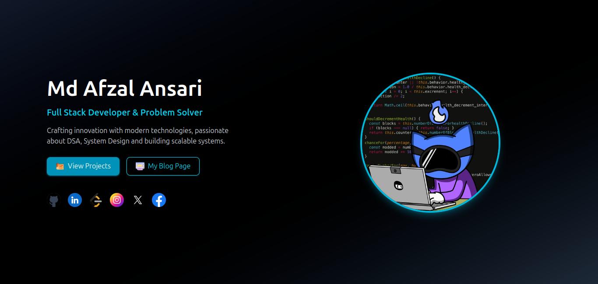
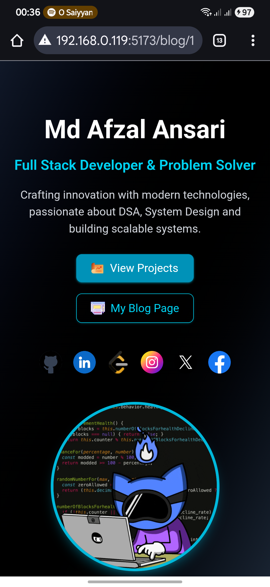

# iamafzal - Developer Portfolio & Knowledge Hub

This is the official personal website for Afzal **(me)**, a tech enthusiast and developer. It serves as a centralized platform with a dual purpose:

1.  **Portfolio Showcase:** A single-page professional landing zone detailing my skills, projects, and contact information.
2.  **Knowledge Hub:** A dedicated space for **blogs** and **resources** where I share my knowledge on various technologies, concepts, and development practices.

## 🛠️ Built With

* **React** & **TypeScript**
* **Tailwind CSS** (for utility-first, responsive styling)
* **Vite** (for lightning-fast development setup and HMR)  

## 🖼️ Screenshots

| Desktop View | Mobile View |
| :---: | :---: |
|  |  |

---

## 🚀 Live Demo

[yet to deployed](https://iamafzal.com) 

## 🎯 Skills & Technologies

| Category | Skills |
| :--- | :--- |
| **Frontend** | React, TypeScript, JavaScript (ES6+), HTML5 |
| **Styling** | Tailwind CSS, Styled-Components |
| **Backend** | Node.js, Express.js, MongoDB (Mongoose) |
| **Tools** | Git/GitHub, Vite, ESLint |
| **Concepts** | Responsive Design, State Management (Context API), API Integration |


## ⚙️ Getting Started

To get a local copy up and running, follow these simple steps.

### Prerequisites

* Node.js (LTS version recommended)
* npm or yarn

### Installation

1.  **Clone the repository:**
    ```bash
    git clone [https://github.com/yourusername/iamafzal-portfolio.git](https://github.com/yourusername/iamafzal-portfolio.git)
    cd iamafzal-portfolio
    ```
2.  **Install project dependencies:**
    ```bash
    npm install  # or yarn install
    ```
3.  **Start the development server:**
    ```bash
    npm run dev  # or yarn dev
    ```
    The application will now be running on `http://localhost:5173`.  

## ⌨️ Available Scripts

| Script | Description |
| :--- | :--- |
| `npm run dev` | Runs the app in development mode using Vite. |
| `npm run build` | Builds the app for production to the `dist` folder. |
| `npm run lint` | Runs the linter (ESLint) to check for code quality issues. |
| `npm run preview` | Serves the production build locally for testing. |  


## 📧 Contact

Afzal - [mdafzal14777@gmail.com](mailto:mdafzal14777@gmail.com)

---
