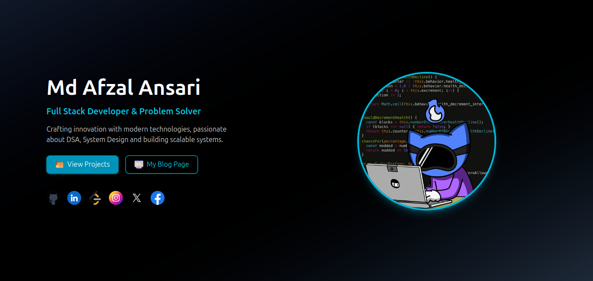
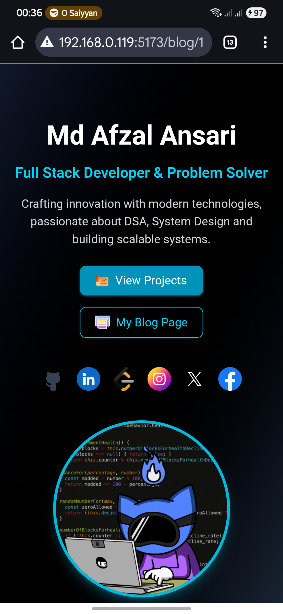
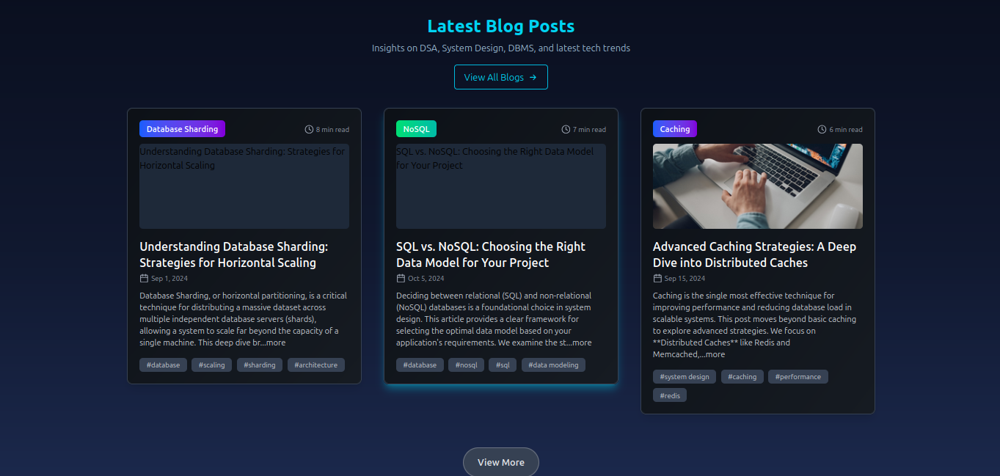
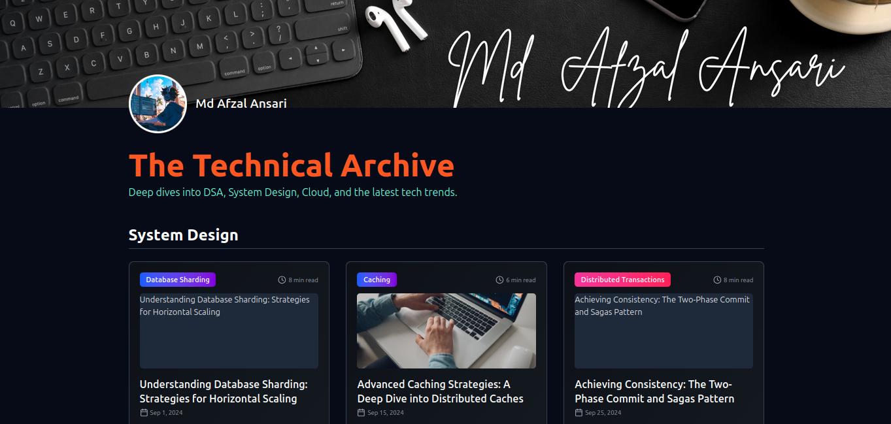
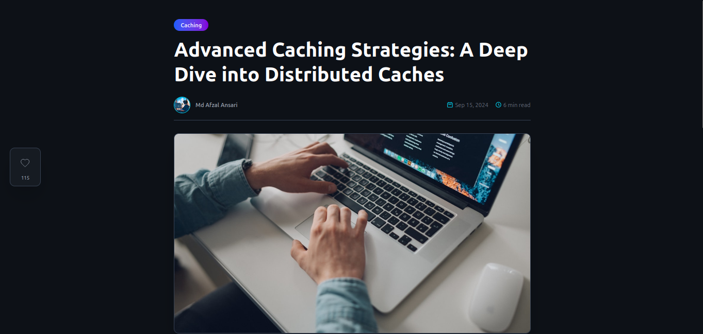
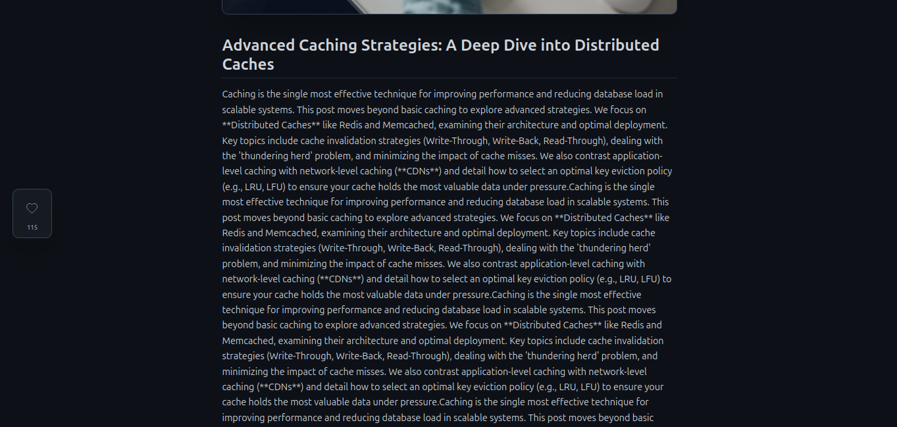
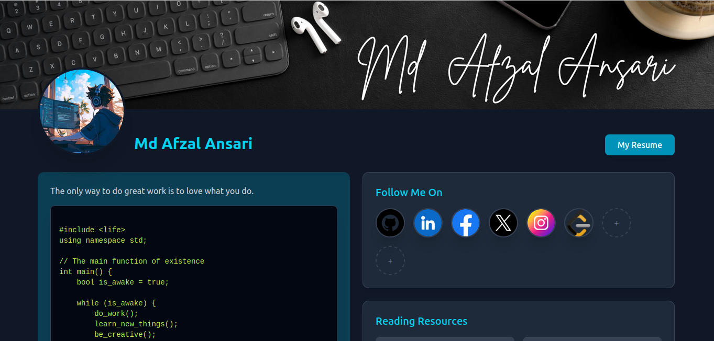

# iamafzal - Developer Portfolio & Knowledge Hub

This is the official personal website for Afzal **(me)**, a tech enthusiast and developer. It serves as a centralized platform with a dual purpose:

1.  **Portfolio Showcase:** A single-page professional landing zone detailing my skills, projects, and contact information.
2.  **Knowledge Hub:** A dedicated space for **blogs** and **resources** where I share my knowledge on various technologies, concepts, and development practices.

## 🛠️ Built With

* **React** & **TypeScript**
* **Tailwind CSS** (for utility-first, responsive styling)
* **Vite** (for lightning-fast development setup and HMR)  

## 🖼️ Screenshots

| Desktop View | Mobile View |
| :---: | :---: |
|  |  |

  
## Also This Portfolio Contain A Blog Section Where All The Blogs User Can Read  




  

---

## 🚀 Live Demo

[yet to deployed](https://iamafzal.com) 

## 🎯 Skills & Technologies

| Category | Skills |
| :--- | :--- |
| **Frontend** | React, TypeScript, JavaScript (ES6+), HTML5 |
| **Styling** | Tailwind CSS, Styled-Components |
| **Backend** | Node.js, Express.js, MongoDB (Mongoose) |
| **Tools** | Git/GitHub, Vite, ESLint |
| **Concepts** | Responsive Design, State Management (Context API), API Integration |


## Folder Structure 
```text
src/
├── api/                  # Axios instances and API services
│   ├── axios.config.ts
├── assets/               # Local images, SVG icons, and global CSS
├── components/           # Reusable UI pieces
│   ├── layout/           # Global wrappers
│   │   ├── Header.tsx    # Sticking macOS Glassy Header
│   │   └── Footer.tsx
│   ├── sections/         # The 7 specific sections
│   │   ├── HomeSection.tsx
│   │   ├── JourneySection.tsx
│   │   ├── SkillSection.tsx
│   │   ├── ProjectSection.tsx
│   │   ├── BlogPreviewSection.tsx
│   │   └── ContactSection.tsx
│   └── ui/               # Base components (Buttons, GlassCard wrapper)
│       └── GlassCard.tsx # Reusable wrapper for the macOS foggy look
├── pages/                # The actual route components
│   ├── HomePage.tsx      # Imports the 6 sections above
│   ├── ReadBlogPage.tsx
│   ├── AllBlogsPage.tsx
│   └── DeepProfilePage.tsx
├── types/                # The TS interfaces defined above
├── App.tsx               # Router configuration
└── index.css             # Tailwind setup and macOS gradient backgrounds
```


## ⚙️ Getting Started

To get a local copy up and running, follow these simple steps.

### Prerequisites

* Node.js (LTS version recommended)
* npm or yarn

### Installation

1.  **Clone the repository:**
    ```bash
    git clone https://github.com/Afzal14786/portfolio-frontend.git
    cd portfolio-frontend
    ```
2.  **Install project dependencies:**
    ```bash
    npm install
    ```
3.  **Start the development server:**
    ```bash
    npm run dev
    ```
    The application will now be running on `http://localhost:5173`.  

## ⌨️ Available Scripts

| Script | Description |
| :--- | :--- |
| `npm run dev` | Runs the app in development mode using Vite. |
| `npm run build` | Builds the app for production to the `dist` folder. |
| `npm run lint` | Runs the linter (ESLint) to check for code quality issues. |
| `npm run preview` | Serves the production build locally for testing. |  


## 📧 Contact

Afzal - [mdafzal14777@gmail.com](mailto:mdafzal14777@gmail.com)

---
